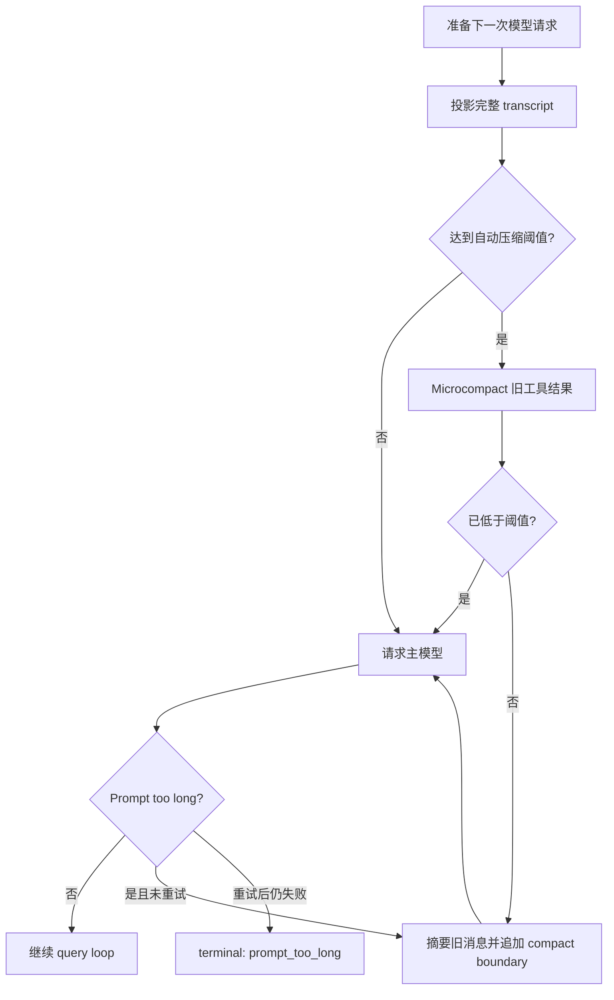

# 第三章 上下文压缩：让 Agent 在长对话中继续工作

前两章让 agent 能循环、能安全调用工具。第三章解决长任务必然遇到的问题：

```text
transcript 可以一直增长，但模型的 context window 不会一直增长。
```

简单粗暴地删除旧消息会丢失目标、决策和工具结果；每轮都把完整历史发给模型，又会越来越慢、越来越贵，最终触发 prompt too long。因此，成熟的 coding agent 需要同时维护两种历史：

- 完整历史：用于审计、界面回看和 resume，保持 append-only。
- 活跃上下文：真正发给模型的投影视图，可以清理旧工具输出，也可以用摘要替换旧对话。

本章实现的不是“把 JSONL 删短”，而是一个独立的 `ContextManager`。

## 和 Claude Code 的对应主线

可以对照本地 Claude Code 源码中的这些位置阅读：

- `src/query.ts`：请求模型前调用 `getMessagesAfterCompactBoundary()`；模型返回 prompt too long 时进入 reactive compact 恢复路径。
- `src/services/compact/autoCompact.ts`：计算有效 context window、自动压缩阈值，并用连续三次失败熔断避免反复请求。
- `src/services/compact/microCompact.ts`：估算消息 token，识别可清理的旧工具结果，并记录被清理的 tool use ID。
- `src/services/compact/compact.ts`：`compactConversation()` 调用模型生成摘要，保留近期状态和附件；摘要请求本身过长时，按 API round 成组截掉最老消息再试。
- `src/utils/messages.ts`：创建 `compact_boundary` / `microcompact_boundary`，查找最后一个 compact boundary，并构造模型可见消息。

Python 版对应实现：

- `coding_agent/agent/context_manager.py`：token 估算、上下文投影、microcompact、原子分组、完整压缩计划和 boundary 提交。
- `coding_agent/agent/models.py`：`TokenUsage`、`SystemMessage`、`CompactionEvent` 和 compact summary 标记。
- `coding_agent/agent/query_loop.py`：自动、手动、prompt-too-long 三种触发路径，以及三次自动压缩失败熔断。
- `coding_agent/agent/openai_model.py`：读取 OpenAI-compatible usage，并把 context length 错误转换成可恢复的 `ModelRequestError`。
- `coding_agent/agent/transcript.py`：持久化 compact boundary，resume 后仍能重建同一份活跃上下文。

## 1. 完整历史与模型视图分离

`QueryLoop.messages` 继续保存完整消息链，任何压缩都只追加记录：

```text
原始 user / assistant / tool_result
  ↓ append
microcompact_boundary
  ↓ append
compact_boundary
  ↓ append
compact summary
```

模型调用前不再直接使用 `self.messages`，而是使用：

```python
self.context_manager.project(self.messages)
```

`project()` 会完成两件事：

1. 找到最后一个 `compact_boundary`，用摘要代替更早的对话，同时恢复被显式保留的近期消息。
2. 收集所有 `microcompact_boundary` 中的 tool use ID，只在投影视图里把对应旧结果替换成占位文本。

原始对象不会被修改，JSONL 里仍然能找到完整工具输出。这个不变量让“节省模型上下文”和“保留审计记录”不再冲突。

## 2. Token 预算不是只数消息条数

不同消息的大小差异很大。一次 `read_file` 可能比几十轮短问答还长，所以自动压缩依据 token 预算，而不是 `len(messages)`。

Python 版按以下优先级计算：

1. OpenAI-compatible 响应带有 `usage` 时，保存 `prompt_tokens`、`completion_tokens` 和 `total_tokens`。
2. 没有 usage 时，用本地估算器统计 system prompt、工具 schema 和消息内容。
3. ASCII 文本按约四个字符一个 token 估算；中文等非 ASCII 字符按更保守的一字符一个 token 估算。

默认参数：

```text
context_window_tokens = 128000
reserved_output_tokens = 8192
auto_compact_ratio = 0.8
```

自动压缩阈值为：

```text
(context_window_tokens - reserved_output_tokens) * auto_compact_ratio
```

这里还有一个容易忽略的细节：microcompact 后，最近一次 API usage 仍然描述压缩前的旧请求。Python 版会从旧 usage 中扣除 boundary 记录的 `tokens_saved`，再用当前投影的本地估算做下限。Claude Code 的 `shouldAutoCompact()` 同样需要修正这种“usage 比投影视图滞后”的情况。

## 3. Microcompact：先清理大块工具输出

很多 coding task 真正占空间的不是自然语言，而是已经看过的文件内容、grep 结果和目录列表。对这些结果立刻生成整段对话摘要成本太高，因此先做便宜的 microcompact：

```text
收集 tool_use 名称和 ID
  ↓
扫描 tool_result，保留最近 N 个
  ↓
跳过错误结果、写入结果和较小结果
  ↓
追加 microcompact_boundary(tool_use_ids, tokens_saved)
  ↓
投影时用短占位文本替换旧结果
```

当前默认保留最近 4 个工具结果，只清理至少 800 字符的旧结果。`write_file` 和 `edit_file` 的 diff 暂不自动清理，这是 Python v1 比 Claude Code 更保守的选择：文件改动证据通常比普通读取结果更值得留在近期上下文里。

microcompact 不调用模型。如果它已经把 token 数降到自动阈值以下，本轮就不再进行完整摘要。

## 4. 完整压缩：摘要旧历史，原样保留近期消息

当 microcompact 仍然不够时，`ContextManager` 会把活跃消息切成原子组：

- 普通 user 或 assistant 消息各自是一组。
- 带 `tool_use` 的 assistant 与紧随其后的 `tool_result` user 消息必须属于同一组。

这个分组保证压缩边界永远不会把工具协议切成两半。随后：

```text
旧消息组 → 交给摘要模型
最近 4 个原子组 → 原样保留
```

摘要模型看不到工具 schema，也不能调用工具。它被要求保留：

- 用户目标。
- 已完成工作。
- 修改或检查过的文件。
- 重要决定与限制。
- 失败和未解决问题。
- 待办任务和推荐下一步。

成功后 transcript 追加两个消息：

```text
SystemMessage(subtype="compact_boundary")
UserMessage(is_compact_summary=True)
```

boundary 元数据记录 summary UUID、被摘要消息 UUID、保留消息 UUID、压缩前后 token 数和摘要调用 usage。resume 时不需要重新调用摘要模型，只需读取这些记录并重新投影。

## 5. 三种触发路径

### 自动压缩

每次正常模型请求前检查 token 数。超过阈值时先 microcompact，再视结果决定是否完整压缩。自动压缩连续失败三次后，本会话停止主动尝试，避免每轮都向 API 发送一个注定失败的摘要请求。

### 手动压缩

CLI 的 `--compact` 会在发送新 prompt 前强制执行完整压缩。配合已有 session，可以只压缩而不继续对话：

```powershell
cd /d "E:\code claude\coding_agent"
& "E:\Anconda\python.exe" -m agent.cli --workspace . --session ".agent_sessions\demo.jsonl" --resume --compact --model-client openai
```

### Reactive compact

本地估算永远可能和服务端 tokenizer 不一致。如果正常请求仍被 API 以 context length 错误拒绝，query loop 会：

```text
识别 ModelRequestError(prompt_too_long=True)
  ↓
强制完整压缩
  ↓
用新投影重试同一轮模型请求一次
  ↓
仍失败则以 terminal reason=prompt_too_long 结束
```

只重试一次是重要的终止条件，防止“错误 → 压缩 → 重试 → 错误”的无限循环。

## 6. 摘要请求本身也可能超长

Claude Code 的 `compactConversation()` 还有一层二阶恢复：如果交给摘要模型的历史本身超过 context window，就按 API round 删除最老分组后重试，最多三次。

Python 版采用同样思路：

- 每次只按原子消息组截断，不拆开 `tool_use` / `tool_result`。
- 每次至少删除一个最老组，同时至少保留一个组。
- 最多重试三次。
- boundary 记录 `dropped_message_uuids`，明确哪些内容因服务端限制没有进入摘要。

这是有损恢复，但比让整个 agent 永远卡在无法生成摘要的状态更可控。

## 7. 状态转移



事件流会产出 `CompactionEvent`：

```text
started
microcompacted（可选）
completed 或 failed
```

CLI 会打印 trigger、压缩前后 token 数和结果说明，transcript 也会保存这些事件。

## 8. 启动与调参

自动压缩默认开启。模型 context window 不是 128K 时，应显式传入真实大小：

```powershell
cd /d "E:\code claude\coding_agent"
& "E:\Anconda\python.exe" -m agent.cli "继续分析这个仓库" --workspace . --model-client openai --context-window-tokens 32768 --reserved-output-tokens 4096 --auto-compact-ratio 0.8
```

常用参数：

- `--no-auto-compact`：关闭主动压缩，但 prompt-too-long 的 reactive compact 仍然可用。
- `--compact`：请求前手动完整压缩；无 prompt 时压缩后直接退出。
- `--preserve-recent-groups 4`：完整压缩后原样保留的近期原子组数量。
- `--microcompact-keep-tool-results 4`：microcompact 不处理的最近工具结果数量。

运行测试：

```powershell
cd /d "E:\code claude\coding_agent"
& "E:\Anconda\python.exe" -m unittest discover -s tests
```

第三章测试覆盖 token usage 映射、原子分组、microcompact、完整摘要、resume 投影、自动与手动触发、prompt-too-long 恢复、摘要请求截断重试和三次失败熔断。

## 9. 当前边界

这仍然是学习版，不等于 Claude Code 的完整上下文系统：

- 没有按具体模型自动读取 context window，需要 CLI 配置。
- 没有精确 tokenizer，当前是 usage 加保守估算。
- 没有恢复 read file cache、plan mode、skill、MCP、异步 agent 等 post-compact attachments。
- 没有 PreCompact / SessionStart hooks。
- 没有 session memory compact 或更细粒度的 context collapse。
- microcompact 当前不处理图片、文档和缓存编辑块。

但主线已经完整：完整历史不丢、模型视图可压缩、工具协议不被拆开、压缩可恢复、失败有上限。下一章可以在这个基础上实现文件化记忆系统，让“当前会话的上下文”与“跨会话长期知识”正式分层。
