# 第五章附录：重点函数流程图谱

这份图谱把第五章的核心代码按照真实调用顺序串起来。建议先看总结构，再沿着 Plan mode 和子 Agent 两条链路分别阅读源码。

## 0. 重点函数索引

| 模块 | 重点函数 | 职责 |
| --- | --- | --- |
| `cli.py` | [`main()`](../coding_agent/agent/cli.py#L400) | CLI 总入口 |
| `cli.py` | [`run_cli()`](../coding_agent/agent/cli.py#L278) | 创建模型、配置、transcript 和 QueryLoop |
| `query_loop.py` | [`QueryLoop.__init__()`](../coding_agent/agent/query_loop.py#L78) | 组装 PlanManager、SubagentManager、工具和权限上下文 |
| `query_loop.py` | [`QueryLoop.run()`](../coding_agent/agent/query_loop.py#L268) | 主 agentic turn 状态机 |
| `query_loop.py` | [`available_tools()`](../coding_agent/agent/query_loop.py#L221) | 计算当前模式下模型可见工具 |
| `query_loop.py` | [`effective_system_prompt()`](../coding_agent/agent/query_loop.py#L241) | 合并基础提示词、计划和记忆 |
| `query_loop.py` | [`_run_tool_batch()`](../coding_agent/agent/query_loop.py#L717) | 模式切换独占检查和工具批次执行 |
| `plan_mode.py` | [`PlanManager.force_enter()`](../coding_agent/agent/plan_mode.py#L267) | 真正把状态切换为 Plan mode |
| `plan_mode.py` | [`request_enter()`](../coding_agent/agent/plan_mode.py#L282) | 请求进入 Plan mode 的审批 |
| `plan_mode.py` | [`request_exit()`](../coding_agent/agent/plan_mode.py#L299) | 校验计划并请求执行审批 |
| `plan_mode.py` | [`filter_tools()`](../coding_agent/agent/plan_mode.py#L380) | 根据 execute/plan 模式过滤工具 |
| `plan_mode.py` | [`permission_override()`](../coding_agent/agent/plan_mode.py#L405) | 执行时复查 Plan mode 路径权限 |
| `plan_mode.py` | [`filter_write_content()`](../coding_agent/agent/plan_mode.py#L429) | 计划写入前脱敏、非空和 token 校验 |
| `subagents.py` | [`AgentTool.call()`](../coding_agent/agent/subagents.py#L407) | 模型调用子 Agent 的工具入口 |
| `subagents.py` | [`SubagentManager.run()`](../coding_agent/agent/subagents.py#L150) | 校验角色、并发控制、取消和超时 |
| `subagents.py` | [`SubagentManager._run_one()`](../coding_agent/agent/subagents.py#L220) | 创建并运行独立子 QueryLoop |
| `tool_orchestration.py` | [`ToolOrchestrator.run()`](../coding_agent/agent/tool_orchestration.py#L60) | 批次编排并保持结果顺序 |
| `tool_orchestration.py` | [`partition_tool_calls()`](../coding_agent/agent/tool_orchestration.py#L233) | 将连续并发安全调用分组 |

## 1. 核心类关系

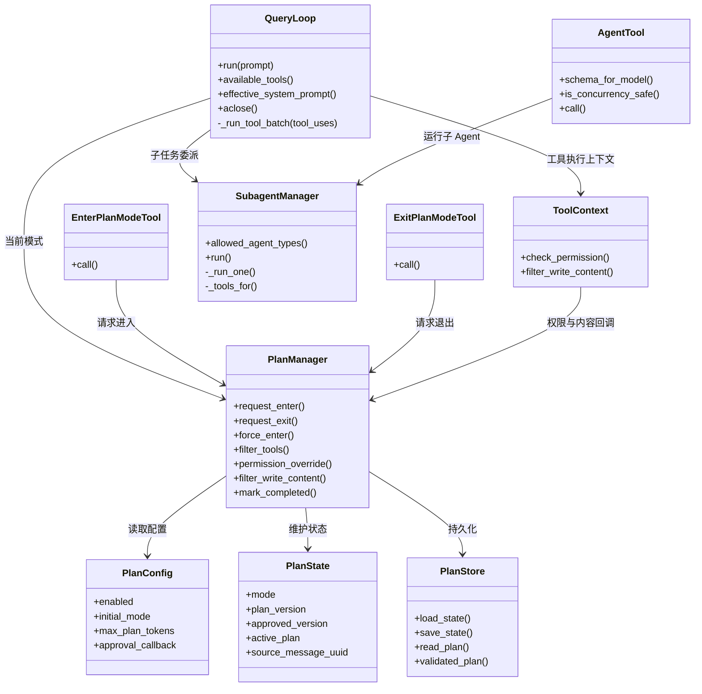
```mermaid
classDiagram
    class QueryLoop {
        +run(prompt)
        +available_tools()
        +effective_system_prompt()
        +aclose()
        -_run_tool_batch(tool_uses)
    }

    class PlanConfig {
        +enabled
        +initial_mode
        +max_plan_tokens
        +approval_callback
    }

    class PlanManager {
        +request_enter()
        +request_exit()
        +force_enter()
        +filter_tools()
        +permission_override()
        +filter_write_content()
        +mark_completed()
    }

    class PlanState {
        +mode
        +plan_version
        +approved_version
        +active_plan
        +source_message_uuid
    }

    class PlanStore {
        +load_state()
        +save_state()
        +read_plan()
        +validated_plan()
    }

    class EnterPlanModeTool {
        +call()
    }

    class ExitPlanModeTool {
        +call()
    }

    class SubagentManager {
        +allowed_agent_types()
        +run()
        -_run_one()
        -_tools_for()
    }

    class AgentTool {
        +schema_for_model()
        +is_concurrency_safe()
        +call()
    }

    class ToolContext {
        +check_permission()
        +filter_write_content()
    }

    QueryLoop --> PlanManager : 当前模式
    QueryLoop --> SubagentManager : 子任务委派
    QueryLoop --> ToolContext : 工具执行上下文
    PlanManager --> PlanConfig : 读取配置
    PlanManager --> PlanState : 维护状态
    PlanManager --> PlanStore : 持久化
    EnterPlanModeTool --> PlanManager : 请求进入
    ExitPlanModeTool --> PlanManager : 请求退出
    AgentTool --> SubagentManager : 运行子 Agent
    ToolContext --> PlanManager : 权限与内容回调
```

## 2. CLI 启动与依赖组装

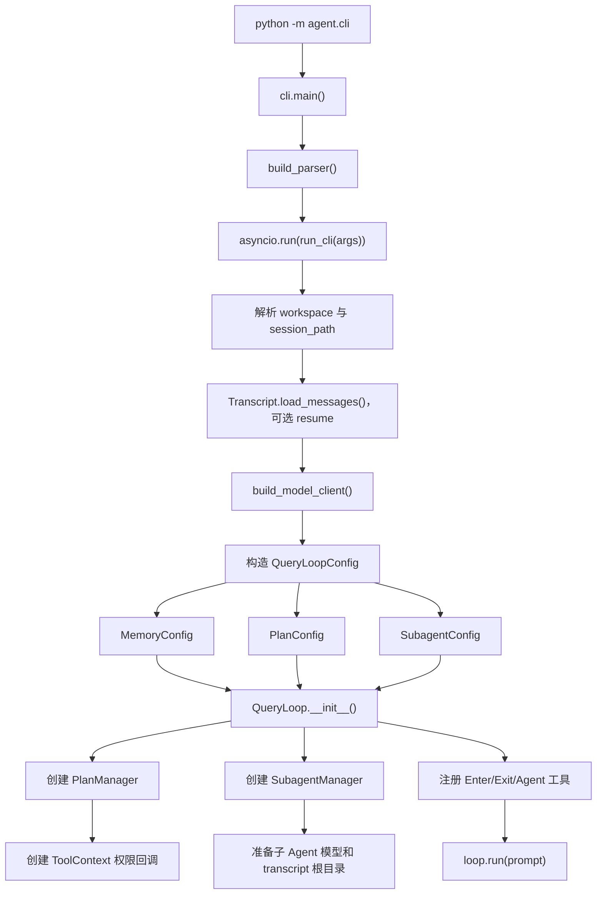
```mermaid
flowchart TD
    A["python -m agent.cli"] --> B["cli.main()"]
    B --> C["build_parser()"]
    C --> D["asyncio.run(run_cli(args))"]
    D --> E["解析 workspace 与 session_path"]
    E --> F["Transcript.load_messages()，可选 resume"]
    F --> G["build_model_client()"]
    G --> H["构造 QueryLoopConfig"]
    H --> H1["MemoryConfig"]
    H --> H2["PlanConfig"]
    H --> H3["SubagentConfig"]
    H1 --> I["QueryLoop.__init__()"]
    H2 --> I
    H3 --> I
    I --> J["创建 PlanManager"]
    I --> K["创建 SubagentManager"]
    I --> L["注册 Enter/Exit/Agent 工具"]
    J --> M["创建 ToolContext 权限回调"]
    K --> N["准备子 Agent 模型和 transcript 根目录"]
    L --> O["loop.run(prompt)"]
```

默认 CLI 中 `PlanConfig.enabled=True` 只表示注册能力，初始模式仍是 `execute`。只有传入 `--plan` 或模型成功调用 `enter_plan_mode`，状态才会进入 `plan`。

## 3. QueryLoop 主循环

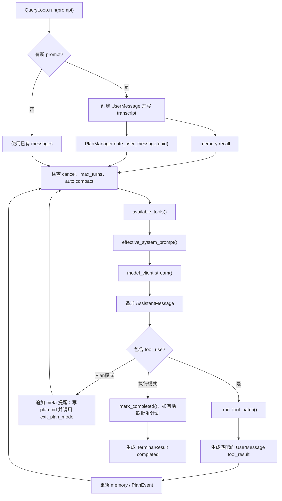
```mermaid
flowchart TD
    A["QueryLoop.run(prompt)"] --> B{"有新 prompt?"}
    B -->|是| C["创建 UserMessage 并写 transcript"]
    C --> D["memory recall"]
    C --> E["PlanManager.note_user_message(uuid)"]
    B -->|否| F["使用已有 messages"]
    D --> G["检查 cancel、max_turns、auto compact"]
    E --> G
    F --> G
    G --> H["available_tools()"]
    H --> I["effective_system_prompt()"]
    I --> J["model_client.stream()"]
    J --> K["追加 AssistantMessage"]
    K --> L{"包含 tool_use?"}
    L -->|是| M["_run_tool_batch()"]
    M --> N["生成匹配的 UserMessage tool_result"]
    N --> O["更新 memory / PlanEvent"]
    O --> G
    L -->|Plan模式| P["追加 meta 提醒：写 plan.md 并调用 exit_plan_mode"]
    P --> G
    L -->|执行模式| Q["mark_completed()，如有活跃批准计划"]
    Q --> R["生成 TerminalResult completed"]
```

这里最重要的不变量是：每个 assistant `tool_use` 都必须得到一个匹配的 user `tool_result`，无论工具成功、失败、被拒绝还是超时。

## 4. PlanManager 初始化与 resume

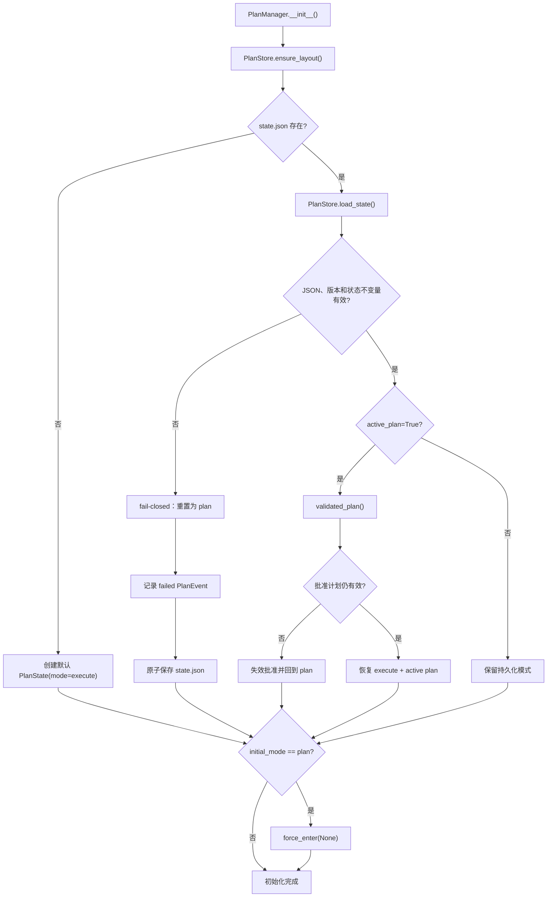
```mermaid
flowchart TD
    A["PlanManager.__init__()"] --> B["PlanStore.ensure_layout()"]
    B --> C{"state.json 存在?"}
    C -->|否| D["创建默认 PlanState(mode=execute)"]
    C -->|是| E["PlanStore.load_state()"]
    E --> F{"JSON、版本和状态不变量有效?"}
    F -->|否| G["fail-closed：重置为 plan"]
    G --> H["记录 failed PlanEvent"]
    H --> I["原子保存 state.json"]
    F -->|是| J{"active_plan=True?"}
    J -->|是| K["validated_plan()"]
    K --> L{"批准计划仍有效?"}
    L -->|否| M["失效批准并回到 plan"]
    L -->|是| N["恢复 execute + active plan"]
    J -->|否| O["保留持久化模式"]
    D --> P{"initial_mode == plan?"}
    I --> P
    M --> P
    N --> P
    O --> P
    P -->|是| Q["force_enter(None)"]
    P -->|否| R["初始化完成"]
    Q --> R
```

## 5. 用户通过 `--plan` 直接开始

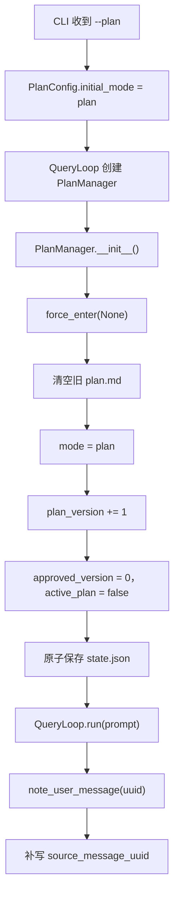
```mermaid
flowchart TD
    A["CLI 收到 --plan"] --> B["PlanConfig.initial_mode = plan"]
    B --> C["QueryLoop 创建 PlanManager"]
    C --> D["PlanManager.__init__()"]
    D --> E["force_enter(None)"]
    E --> F["清空旧 plan.md"]
    F --> G["mode = plan"]
    G --> H["plan_version += 1"]
    H --> I["approved_version = 0，active_plan = false"]
    I --> J["原子保存 state.json"]
    J --> K["QueryLoop.run(prompt)"]
    K --> L["note_user_message(uuid)"]
    L --> M["补写 source_message_uuid"]
```

这条路径不调用审批回调，因为 `--plan` 本身就是用户的显式决定。

## 6. 模型调用 `enter_plan_mode`

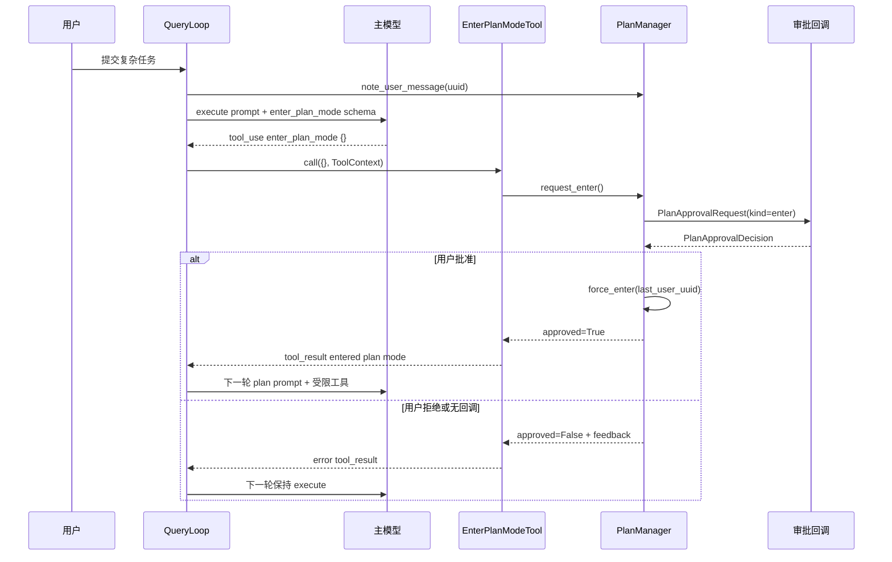
```mermaid
sequenceDiagram
    participant U as 用户
    participant Q as QueryLoop
    participant M as 主模型
    participant T as EnterPlanModeTool
    participant P as PlanManager
    participant C as 审批回调

    U->>Q: 提交复杂任务
    Q->>P: note_user_message(uuid)
    Q->>M: execute prompt + enter_plan_mode schema
    M-->>Q: tool_use enter_plan_mode {}
    Q->>T: call({}, ToolContext)
    T->>P: request_enter()
    P->>C: PlanApprovalRequest(kind=enter)
    C-->>P: PlanApprovalDecision
    alt 用户批准
        P->>P: force_enter(last_user_uuid)
        P-->>T: approved=True
        T-->>Q: tool_result entered plan mode
        Q->>M: 下一轮 plan prompt + 受限工具
    else 用户拒绝或无回调
        P-->>T: approved=False + feedback
        T-->>Q: error tool_result
        Q->>M: 下一轮保持 execute
    end
```

## 7. 模式提示词与工具过滤

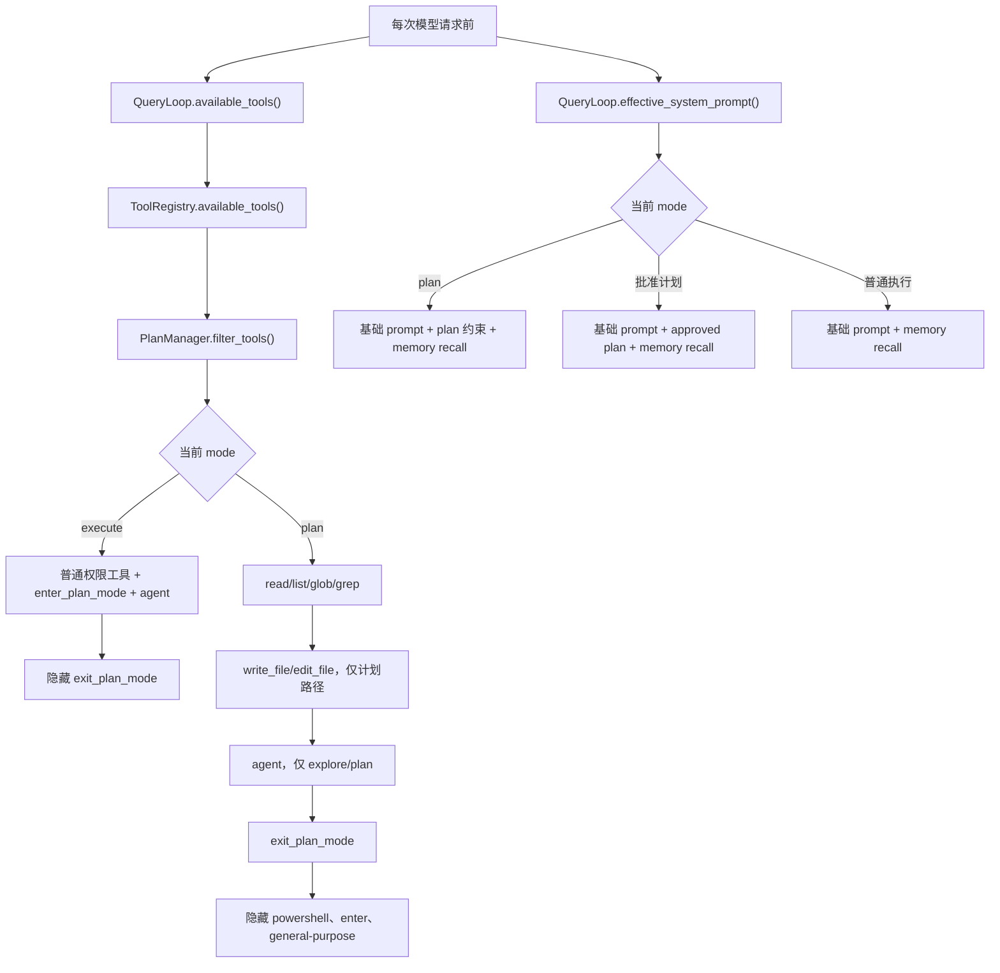
```mermaid
flowchart TD
    A["每次模型请求前"] --> B["QueryLoop.available_tools()"]
    A --> C["QueryLoop.effective_system_prompt()"]
    B --> D["ToolRegistry.available_tools()"]
    D --> E["PlanManager.filter_tools()"]
    E --> F{"当前 mode"}
    F -->|execute| G["普通权限工具 + enter_plan_mode + agent"]
    G --> H["隐藏 exit_plan_mode"]
    F -->|plan| I["read/list/glob/grep"]
    I --> J["write_file/edit_file，仅计划路径"]
    J --> K["agent，仅 explore/plan"]
    K --> L["exit_plan_mode"]
    L --> M["隐藏 powershell、enter、general-purpose"]
    C --> N{"当前 mode"}
    N -->|plan| O["基础 prompt + plan 约束 + memory recall"]
    N -->|批准计划| P["基础 prompt + approved plan + memory recall"]
    N -->|普通执行| Q["基础 prompt + memory recall"]
```

工具隐藏只是第一层。执行器仍然会使用本轮 `allowed_tool_names` 和 `permission_override()` 再检查一次，防止模型伪造未公开工具调用。

## 8. `plan.md` 写入安全链路

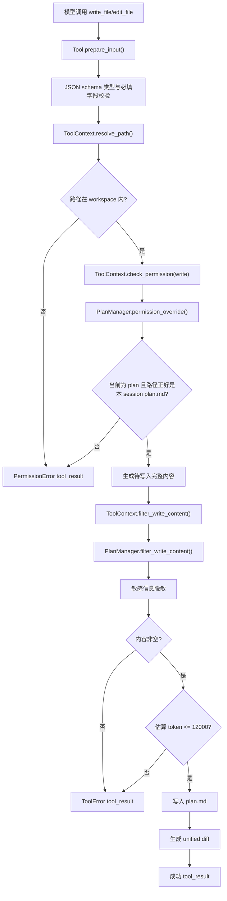
```mermaid
flowchart TD
    A["模型调用 write_file/edit_file"] --> B["Tool.prepare_input()"]
    B --> C["JSON schema 类型与必填字段校验"]
    C --> D["ToolContext.resolve_path()"]
    D --> E{"路径在 workspace 内?"}
    E -->|否| F["PermissionError tool_result"]
    E -->|是| G["ToolContext.check_permission(write)"]
    G --> H["PlanManager.permission_override()"]
    H --> I{"当前为 plan 且路径正好是本 session plan.md?"}
    I -->|否| F
    I -->|是| J["生成待写入完整内容"]
    J --> K["ToolContext.filter_write_content()"]
    K --> L["PlanManager.filter_write_content()"]
    L --> M["敏感信息脱敏"]
    M --> N{"内容非空?"}
    N -->|否| O["ToolError tool_result"]
    N -->|是| P{"估算 token <= 12000?"}
    P -->|否| O
    P -->|是| Q["写入 plan.md"]
    Q --> R["生成 unified diff"]
    R --> S["成功 tool_result"]
```

`.agent_plans/` 被视为内部状态目录。execute mode 下普通写工具也不能修改这里，避免批准后的计划被静默篡改。

## 9. 模式切换工具独占批次

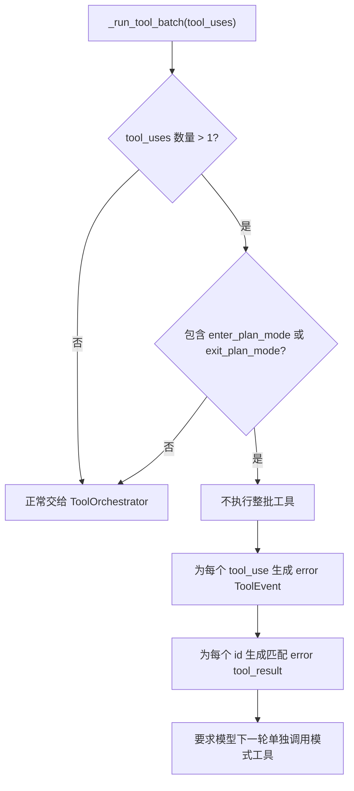
```mermaid
flowchart TD
    A["_run_tool_batch(tool_uses)"] --> B{"tool_uses 数量 > 1?"}
    B -->|否| C["正常交给 ToolOrchestrator"]
    B -->|是| D{"包含 enter_plan_mode 或 exit_plan_mode?"}
    D -->|否| C
    D -->|是| E["不执行整批工具"]
    E --> F["为每个 tool_use 生成 error ToolEvent"]
    F --> G["为每个 id 生成匹配 error tool_result"]
    G --> H["要求模型下一轮单独调用模式工具"]
```

这避免模型在审批前生成的项目写入参数，在 `exit_plan_mode` 获批后沿用新的 execute 权限继续执行。

## 10. `exit_plan_mode` 批准与拒绝

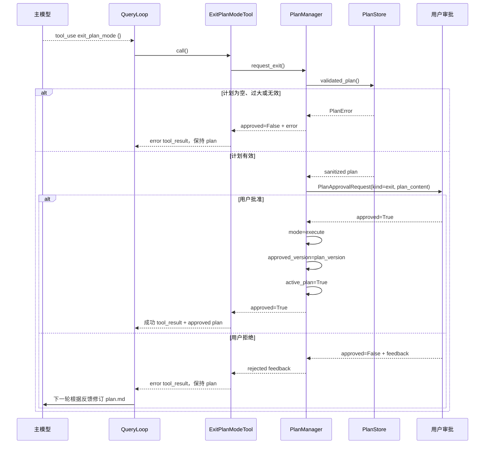
```mermaid
sequenceDiagram
    participant M as 主模型
    participant Q as QueryLoop
    participant T as ExitPlanModeTool
    participant P as PlanManager
    participant S as PlanStore
    participant U as 用户审批

    M-->>Q: tool_use exit_plan_mode {}
    Q->>T: call()
    T->>P: request_exit()
    P->>S: validated_plan()
    alt 计划为空、过大或无效
        S-->>P: PlanError
        P-->>T: approved=False + error
        T-->>Q: error tool_result，保持 plan
    else 计划有效
        S-->>P: sanitized plan
        P->>U: PlanApprovalRequest(kind=exit, plan_content)
        alt 用户批准
            U-->>P: approved=True
            P->>P: mode=execute
            P->>P: approved_version=plan_version
            P->>P: active_plan=True
            P-->>T: approved=True
            T-->>Q: 成功 tool_result + approved plan
        else 用户拒绝
            U-->>P: approved=False + feedback
            P-->>T: rejected feedback
            T-->>Q: error tool_result，保持 plan
            Q->>M: 下一轮根据反馈修订 plan.md
        end
    end
```

## 11. Plan mode 不能用普通文本结束

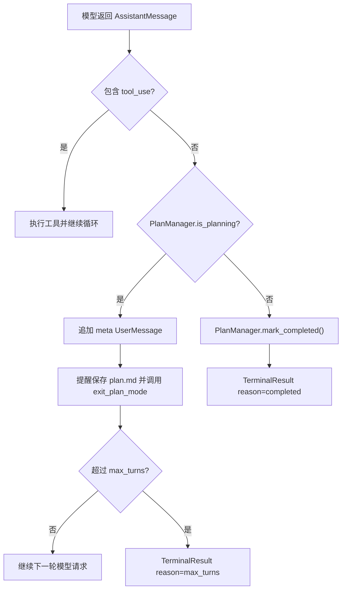
```mermaid
flowchart TD
    A["模型返回 AssistantMessage"] --> B{"包含 tool_use?"}
    B -->|是| C["执行工具并继续循环"]
    B -->|否| D{"PlanManager.is_planning?"}
    D -->|是| E["追加 meta UserMessage"]
    E --> F["提醒保存 plan.md 并调用 exit_plan_mode"]
    F --> G{"超过 max_turns?"}
    G -->|否| H["继续下一轮模型请求"]
    G -->|是| I["TerminalResult reason=max_turns"]
    D -->|否| J["PlanManager.mark_completed()"]
    J --> K["TerminalResult reason=completed"]
```

这保证 Plan mode 的终点是显式审批工具，而不是模型输出一句“计划如下”后直接结束。

## 12. 批准计划的执行与完成

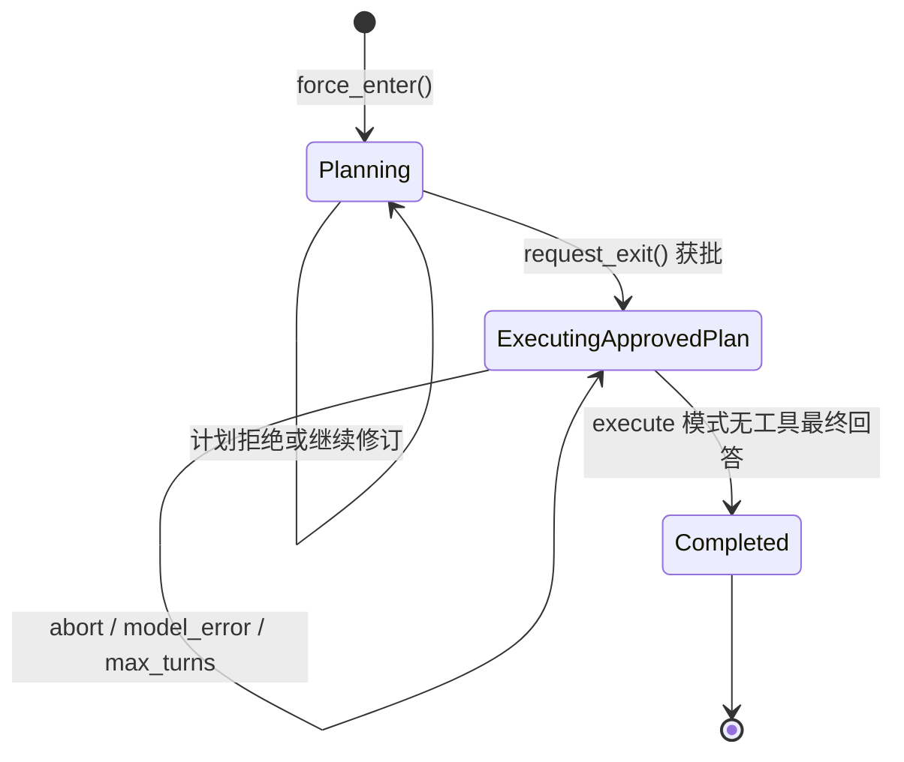
```mermaid
stateDiagram-v2
    [*] --> Planning: force_enter()
    Planning --> Planning: 计划拒绝或继续修订
    Planning --> ExecutingApprovedPlan: request_exit() 获批
    ExecutingApprovedPlan --> ExecutingApprovedPlan: read/write/shell/agent 工具轮次
    ExecutingApprovedPlan --> Completed: execute 模式无工具最终回答
    ExecutingApprovedPlan --> ExecutingApprovedPlan: abort / model_error / max_turns
    Completed --> [*]
```

只有正常无工具最终回答会调用 `mark_completed()`。abort、错误和 `max_turns` 不会把计划误标为完成。

## 13. compact 与 resume 中的 Plan 状态

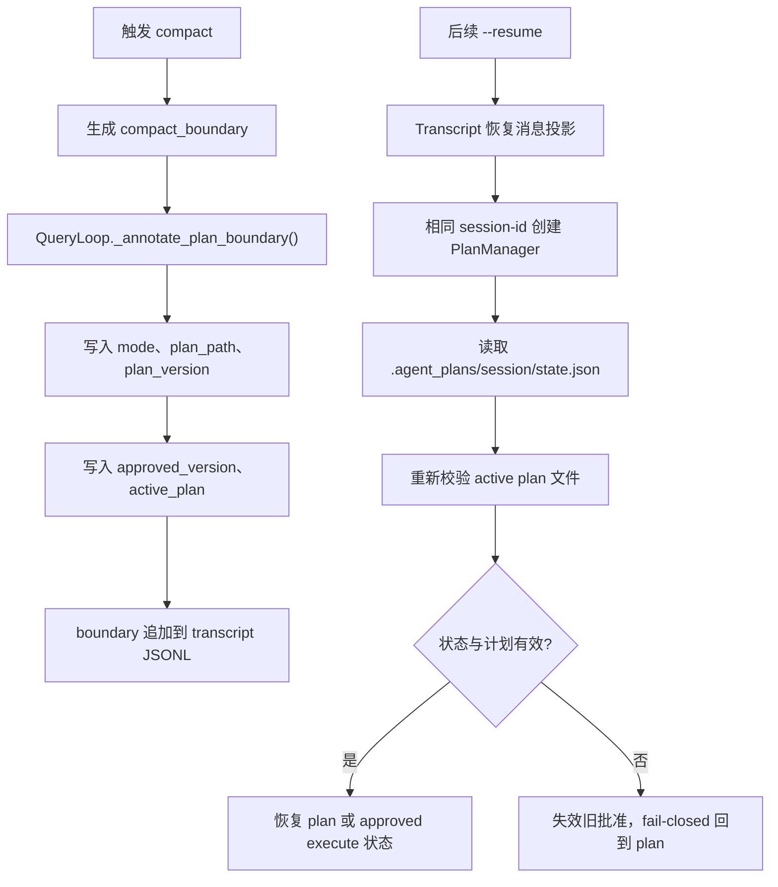
```mermaid
flowchart TD
    A["触发 compact"] --> B["生成 compact_boundary"]
    B --> C["QueryLoop._annotate_plan_boundary()"]
    C --> D["写入 mode、plan_path、plan_version"]
    D --> E["写入 approved_version、active_plan"]
    E --> F["boundary 追加到 transcript JSONL"]

    G["后续 --resume"] --> H["Transcript 恢复消息投影"]
    H --> I["相同 session-id 创建 PlanManager"]
    I --> J["读取 .agent_plans/session/state.json"]
    J --> K["重新校验 active plan 文件"]
    K --> L{"状态与计划有效?"}
    L -->|是| M["恢复 plan 或 approved execute 状态"]
    L -->|否| N["失效旧批准，fail-closed 回到 plan"]
```

权限状态以 `state.json` 和计划文件为准，compact 摘要只负责上下文，不是批准状态的唯一来源。

## 14. `agent` 工具委派总流程

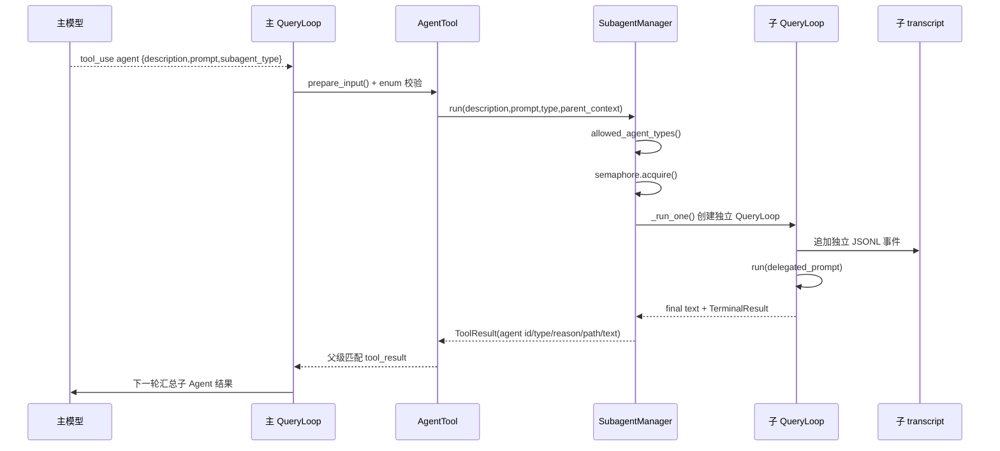
```mermaid
sequenceDiagram
    participant M as 主模型
    participant Q as 主 QueryLoop
    participant A as AgentTool
    participant S as SubagentManager
    participant C as 子 QueryLoop
    participant T as 子 transcript

    M-->>Q: tool_use agent {description,prompt,subagent_type}
    Q->>A: prepare_input() + enum 校验
    A->>S: run(description,prompt,type,parent_context)
    S->>S: allowed_agent_types()
    S->>S: semaphore.acquire()
    S->>C: _run_one() 创建独立 QueryLoop
    C->>T: 追加独立 JSONL 事件
    C->>C: run(delegated_prompt)
    C-->>S: final text + TerminalResult
    S-->>A: ToolResult(agent id/type/reason/path/text)
    A-->>Q: 父级匹配 tool_result
    Q->>M: 下一轮汇总子 Agent 结果
```

## 15. 三类子 Agent 的工具选择

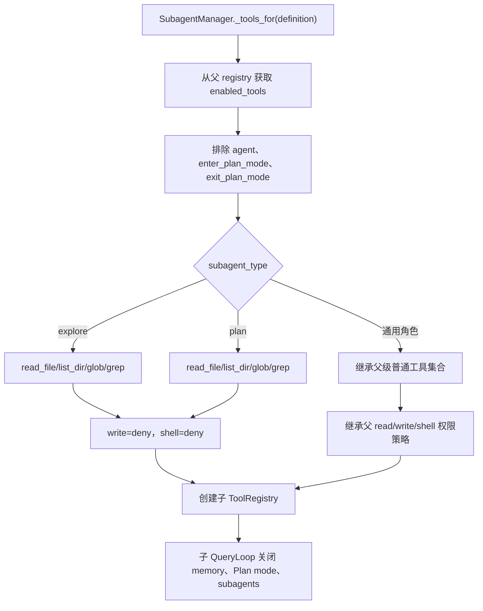
```mermaid
flowchart TD
    A["SubagentManager._tools_for(definition)"] --> B["从父 registry 获取 enabled_tools"]
    B --> C["排除 agent、enter_plan_mode、exit_plan_mode"]
    C --> D{"subagent_type"}
    D -->|explore| E["read_file/list_dir/glob/grep"]
    D -->|plan| F["read_file/list_dir/glob/grep"]
    D -->|通用角色| G["继承父级普通工具集合"]
    E --> H["write=deny，shell=deny"]
    F --> H
    G --> I["继承父 read/write/shell 权限策略"]
    H --> J["创建子 ToolRegistry"]
    I --> J
    J --> K["子 QueryLoop 关闭 memory、Plan mode、subagents"]
```

在主 Agent 的 Plan mode 中，`allowed_agent_types()` 只返回 `explore` 和 `plan`。`general-purpose` 不仅从 schema enum 中消失，伪造调用也会在创建子循环之前被拒绝。

## 16. 子 Agent 独立上下文

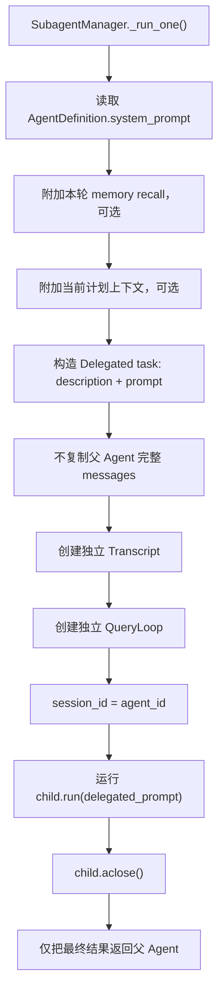
```mermaid
flowchart TD
    A["SubagentManager._run_one()"] --> B["读取 AgentDefinition.system_prompt"]
    B --> C["附加本轮 memory recall，可选"]
    C --> D["附加当前计划上下文，可选"]
    D --> E["构造 Delegated task: description + prompt"]
    E --> F["不复制父 Agent 完整 messages"]
    F --> G["创建独立 Transcript"]
    G --> H["创建独立 QueryLoop"]
    H --> I["session_id = agent_id"]
    I --> J["运行 child.run(delegated_prompt)"]
    J --> K["child.aclose()"]
    K --> L["仅把最终结果返回父 Agent"]
```

子 transcript 保存到：

```text
.agent_sessions/subagents/<parent-session-id>/<agent-id>.jsonl
```

## 17. 子 Agent 并发与结果顺序

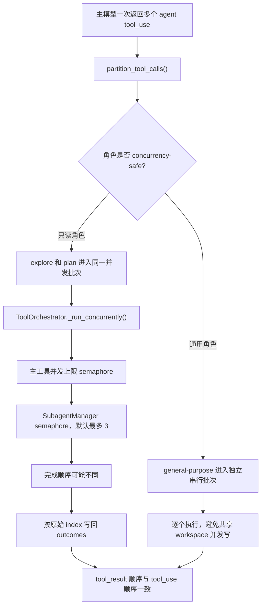
```mermaid
flowchart TD
    A["主模型一次返回多个 agent tool_use"] --> B["partition_tool_calls()"]
    B --> C{"角色是否 concurrency-safe?"}
    C -->|只读角色| D["explore 和 plan 进入同一并发批次"]
    C -->|通用角色| E["general-purpose 进入独立串行批次"]
    D --> F["ToolOrchestrator._run_concurrently()"]
    F --> G["主工具并发上限 semaphore"]
    G --> H["SubagentManager semaphore，默认最多 3"]
    H --> I["完成顺序可能不同"]
    I --> J["按原始 index 写回 outcomes"]
    E --> K["逐个执行，避免共享 workspace 并发写"]
    J --> L["tool_result 顺序与 tool_use 顺序一致"]
    K --> L
```

## 18. 子 Agent 取消、超时和错误降级

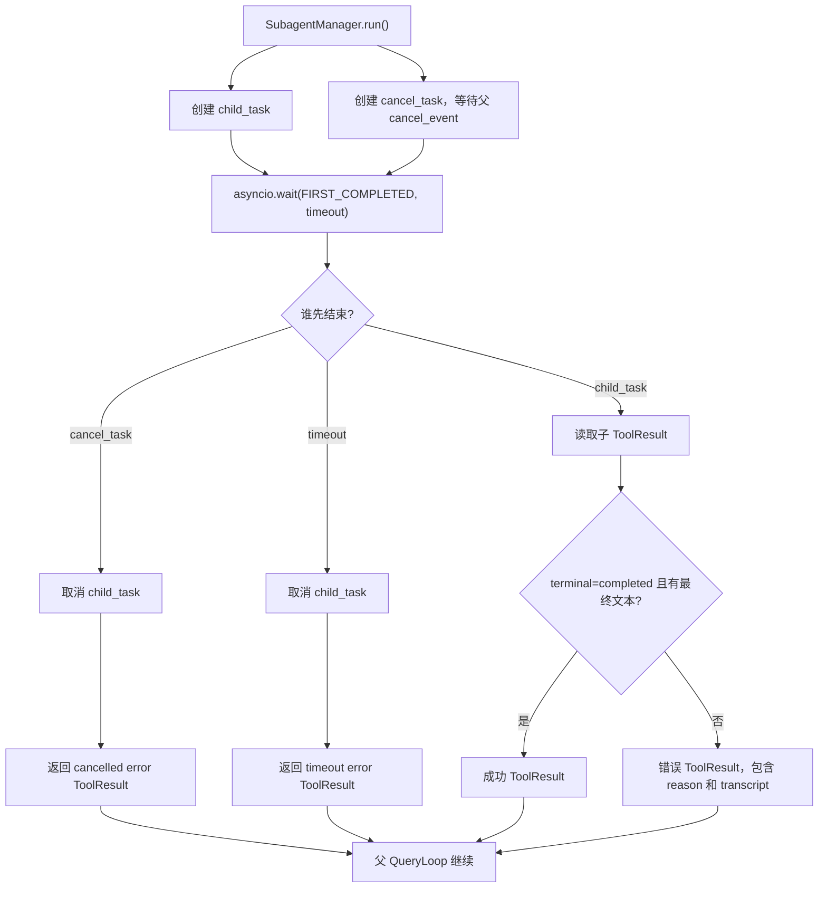
```mermaid
flowchart TD
    A["SubagentManager.run()"] --> B["创建 child_task"]
    A --> C["创建 cancel_task，等待父 cancel_event"]
    B --> D["asyncio.wait(FIRST_COMPLETED, timeout)"]
    C --> D
    D --> E{"谁先结束?"}
    E -->|child_task| F["读取子 ToolResult"]
    E -->|cancel_task| G["取消 child_task"]
    E -->|timeout| H["取消 child_task"]
    G --> I["返回 cancelled error ToolResult"]
    H --> J["返回 timeout error ToolResult"]
    F --> K{"terminal=completed 且有最终文本?"}
    K -->|是| L["成功 ToolResult"]
    K -->|否| M["错误 ToolResult，包含 reason 和 transcript"]
    I --> N["父 QueryLoop 继续"]
    J --> N
    L --> N
    M --> N
```

子 Agent 失败不会抛穿主 QueryLoop，而是严格降级成当前 `agent` 工具调用的错误结果。

## 19. 工具执行的最终安全链路

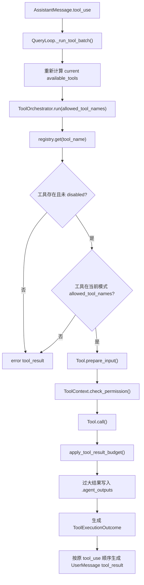
```mermaid
flowchart TD
    A["AssistantMessage.tool_use"] --> B["QueryLoop._run_tool_batch()"]
    B --> C["重新计算 current available_tools"]
    C --> D["ToolOrchestrator.run(allowed_tool_names)"]
    D --> E["registry.get(tool_name)"]
    E --> F{"工具存在且未 disabled?"}
    F -->|否| G["error tool_result"]
    F -->|是| H{"工具在当前模式 allowed_tool_names?"}
    H -->|否| G
    H -->|是| I["Tool.prepare_input()"]
    I --> J["ToolContext.check_permission()"]
    J --> K["Tool.call()"]
    K --> L["apply_tool_result_budget()"]
    L --> M["过大结果写入 .agent_outputs"]
    M --> N["生成 ToolExecutionOutcome"]
    N --> O["按原 tool_use 顺序生成 UserMessage tool_result"]
```

## 20. 推荐断点顺序

调试 Plan mode：

```text
cli.run_cli()
→ QueryLoop.__init__()
→ QueryLoop.run()
→ QueryLoop.available_tools()
→ EnterPlanModeTool.call()
→ PlanManager.request_enter()
→ PlanManager.force_enter()
→ PlanManager.filter_tools()
→ PlanManager.permission_override()
→ ExitPlanModeTool.call()
→ PlanManager.request_exit()
```

调试子 Agent：

```text
QueryLoop._run_tool_batch()
→ ToolOrchestrator.run()
→ AgentTool.call()
→ SubagentManager.run()
→ SubagentManager._run_one()
→ child QueryLoop.run()
→ child QueryLoop.aclose()
→ parent tool_result
```

只要抓住两个入口就不会迷路：Plan mode 的真实状态开关是 `PlanManager.force_enter()`，子 Agent 的真实创建入口是 `SubagentManager._run_one()`。
